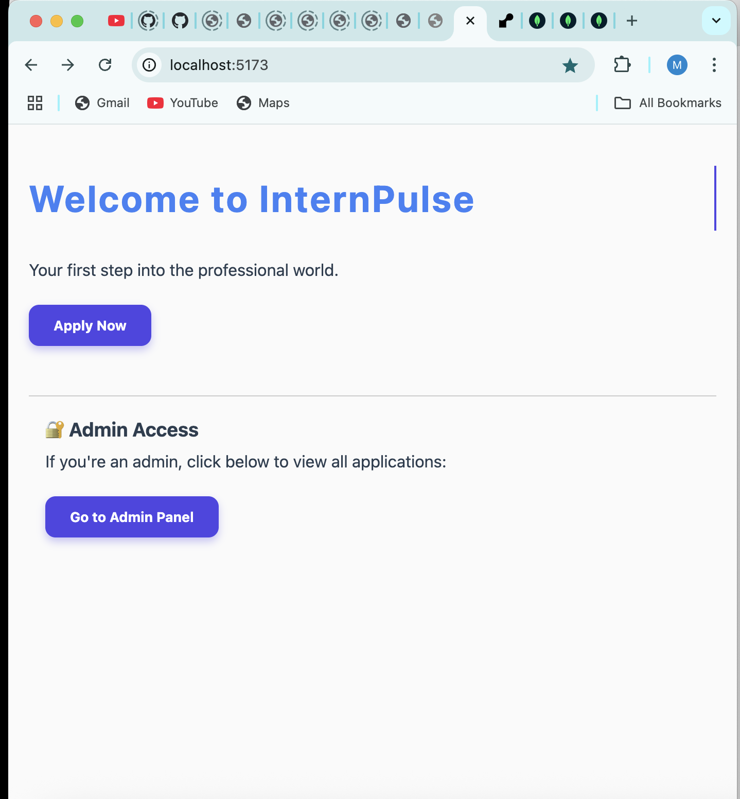

# Basti Ka Pathsala Internship Portal

Welcome to the official repository for **Basti Ka Pathsala Internship Portal**. This project streamlines the application and management process for internships and volunteer opportunities at Basti Ka Pathsala.

---

## Features

- **Home Page:** Introduction and navigation for applicants and admins.
- **Registration Form:** Submit details for internship or volunteer roles.
- **Admin Panel:** View all submitted applications.
- **MongoDB Integration:** Secure data storage and management.

---

## Screenshots & Details

### 1. Home Page

The landing page welcomes users and provides navigation for both applicants and administrators.

---

### 2. Registration Form

Applicants fill out their details and submit their application. A confirmation alert is shown upon successful submission.

---

### 3. MongoDB Atlas Database

All applications are stored in the `internpulse.applications` collection in MongoDB Atlas, with applicant details and submission timestamp.

---

### 4. Admin Panel

Admins can view all submitted applications in a card-based layout, displaying applicant information and status.

---

## Technologies Used

- **Frontend:** React.js, Axios
- **Backend:** Node.js, Express.js
- **Database:** MongoDB Atlas
- **Styling:** CSS

---

## How It Works

1. **Candidate Registration:** Users fill out and submit the registration form.
2. **Data Storage:** Application data is sent to the backend and stored in MongoDB.
3. **Admin Review:** Admins access the dashboard to review all applications.

---

## Getting Started

1. Clone the repository.
2. Install dependencies for both frontend and backend.
3. Set up your MongoDB Atlas connection string in the backend.
4. Run both frontend and backend servers.
5. Access the portal via `localhost:5173`.

---

## License

This project is for educational and community purposes under Basti Ka Pathsala.
